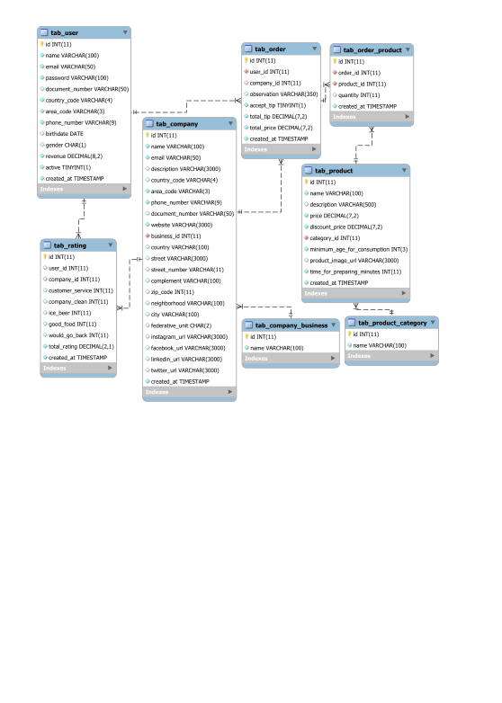

<h1 align="center">
    
</h1>

## 📝 Project
Ô Chefia is a application to change the way the customer consumes at pub today.
- You can pay your order directly in the app
- Find the near pubs from you
- Share bill's payment with friends
- And still accumulate points to redeem prizes
- Change the entire consumer experience for the better

[Demo video](https://www.youtube.com/watch?v=OWy9gkgBt7k&feature=youtu.be)
## Description

This backend has the main responsabilities:  

* To do all interactions with databases
* To connect with other APIS like Gr1d, Zenvia, Serasa and others

## Technologies 

* Language:
  - [Golang](https://golang.org/)  

* Database:
  - MySQL  
  

## Start application
### Requirements:
* To run this project you need to have the <b>docker</b> installed in your computer.  
* To install docker, [click here](https://docs.docker.com/get-docker/)

### Permissions first:  

* For <b>Unix</b> enviroment, run the comand:  
<b>```chmod +x .docker/entrypoint.sh```</b>  

* For <b>Windows</b> enviroment, run the comand:   
<b>```dos2unix +x .docker/entrypoint.sh```</b>  

### Start:
* Now you can run:  <br>
<b>```docker-compose up```</b>
<br><br>